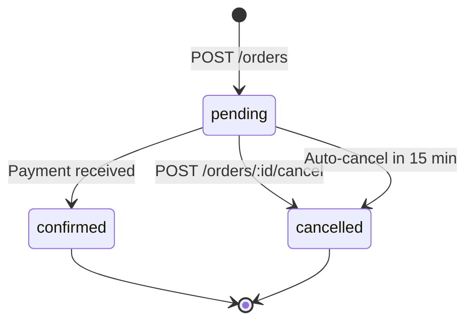

# Qulpunoy - Order & Inventory Management under high concurrency

## Task Requirements (MUST)

#### General

1. No AI. Har bir decision README'da yoritilsin.
2. Githubda public repository bo'lishi va reasonable commit history bo'lsin.
3. Database ER diagram dbdiagram.io orqali chizilsin.
4. Kod arxitekturasi qatlamlarga ajratilgan bo'lsin, masalan: handler/controller, service, repository.
5. Docker compose bilan bitta buyruqda standard portda (e.g. 8080) ishga tushsin.

#### Functional

1. API structura quyidagicha:
    * `POST /products` - mahsulot yaratish (name, price, stock_quantity);
    * `POST /orders` - bir nechta item'li buyurtma, Idempotency-Key header majburiy (bir xil key bilan qayta yuborilsa, stock ikkinchi marta kamaymasligi kerak);
    * `GET /orders/{id}` - status: pending -> confirmed / cancelled;
    * `POST /orders/{id}/cancel` - reserved stock qaytarilishi kerak;
2. Authorization: JWT bo'lsin.
3. Background Job: 15 daqiqa ichida to'lanmagan pending buyurtmalar avtomatik bekor qilinsin.

#### Technical

1. Database: PostgreSQL majburiy. ORM ishlatilmasin, SQL query qo'lda yozilishi shart.
2. Caching: Redis orqali keshlansin, caching strategylar izohlansin.
3. Concurrency: 50 ta parallel so'rov bitta productga (stock=10) yuborilganda, aynan 10 tasi muvaffaqiyatli bo'lishi kerak - qolgani 409/422 bilan qaytishi kerak.

---

## Overview

**Language:** Go
**Libraries:** chi, pgx, goose

Bu system-level project bo'lgani sabab, uni qurishda dastlab aniq reja tuzib, keyin implement qilishni ma'qul ko'raman. Shu sabab umumiy "mundarija" quyidagicha:

1. Invariants, State Machines
2. DB structure & ER diagram
3. Transaction Boundaries
4. SQL queries
5. Background Job (behaviour under concurrency)
6. Caching strategy
7. Testing: Integration and Load tests

Implementatsiya parallel davom etadi. 
Faqatgina testing qismiga AI ishlatishim mumkin, lekin harakat qilaman o'zim yozishga.

## Process & Decisions

### S1: Invariants & State Machines

Ishni boshlashdan oldin nima bo'lishi va nima bo'lmasligi shart (MUST) ekanini aniqlashtirib olsak, impl paytida ikkilanish bo'lmaydi. Statelarni aniq define qilib olsak, impl paytida dovdirash bo'lmaydi.

#### Invariants

1. Order yaratilishi va stock mos ravishda kamayishi: Yo ikkisi ham bo'ladi yo hech qaysisi.
2. Stock har doim non-negative (>=0).
3. Tasdiqlangan order otmen qilib bo'lmaydi.
4. Otmen qilingan order tasdiqlab bo'lmaydi.
5. Order kamida 1 ta itemdan iborat bo'lishi shart.
6. Narx order create qilingandan keyin o'zgarsa ham zakaz oldingi narxda turishi kerak.
7. Orderni otmen qilish zakazni faqat 1 marta tiklaydi, hatto user 15 minutlik background job bilan bir vaqtda cancel qilsa ham.
8. Product narxi >0 bo'lishi shart.
9. Product stock_quantity'si >=0 bo'lishi shart.
10. Har bir idempotency keyga faqat bitta order to'g'ri kelishi va bir xil idempotency key N marta yuborilganda ham faqat bitta order yaratilishi hamda stock faqat 1 marta kamayishi shart.

#### State Machine(s)

Mermaid diagramma orqali State Machine chizib olaman. Endi aniq bo'ldi qanday statelar bor va qanday transitionlar qila olaman yo yo'q:

### S2: DB structure & ER diagram

Asosiysi shu 3 ta jadval bo'lishi aniq: `products`, `orders` va `order_items`. Lekin shartda JWT auth ham so'ralishi, va umuman concurrency muammosi ham, bizga `users` jadvali ham kerakligini mean qiladi. Ortiqcha metadata va business fieldlarni olib tashlasak, chizma quyidagicha bo'ladi:

DBdiagram link: https://dbdiagram.io/d/testtask-6aa09a9a28e65f9ec2553d76

Endi, bizda idempotency masalasi bor. Uni qanday model qilganimiz afzalroq, degan savol. 

### S3: Transaction Boundaries

### S4: SQL queries

### S5: Background Job

### S6: Caching

### S7: Testing: Integration and Load

