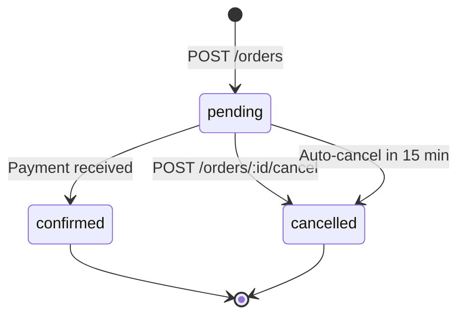
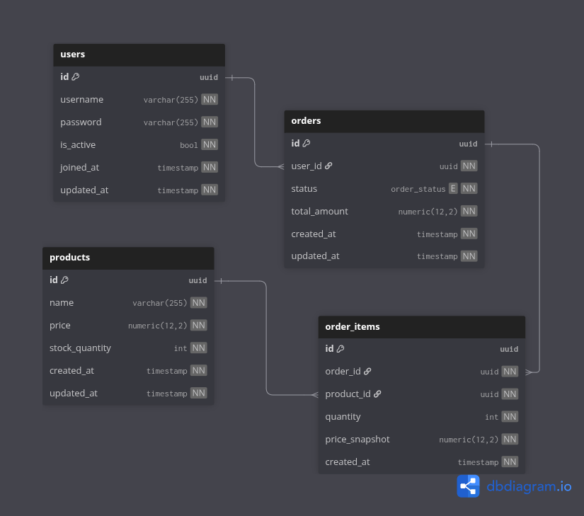

# Qulpunoy - Order & Inventory Management under high concurrency

## Task Requirements (MUST)

#### General

1. No AI. Har bir decision README'da yoritilsin.
2. Githubda public repository bo'lishi va reasonable commit history bo'lsin.
3. Database ER diagram dbdiagram.io orqali chizilsin.
4. Kod arxitekturasi qatlamlarga ajratilgan bo'lsin, masalan: handler/controller, service, repository.
5. Docker compose bilan bitta buyruqda standard portda (e.g. 8080) ishga tushsin.

#### Functional

1. API structura quyidagicha:
    * `POST /products` - mahsulot yaratish (name, price, stock_quantity);
    * `POST /orders` - bir nechta item'li buyurtma, Idempotency-Key header majburiy (bir xil key bilan qayta yuborilsa, stock ikkinchi marta kamaymasligi kerak);
    * `GET /orders/{id}` - status: pending -> confirmed / cancelled;
    * `POST /orders/{id}/cancel` - reserved stock qaytarilishi kerak;
2. Authorization: JWT bo'lsin.
3. Background Job: 15 daqiqa ichida to'lanmagan pending buyurtmalar avtomatik bekor qilinsin.

#### Technical

1. Database: PostgreSQL majburiy. ORM ishlatilmasin, SQL query qo'lda yozilishi shart.
2. Caching: Redis orqali keshlansin, caching strategylar izohlansin.
3. Concurrency: 50 ta parallel so'rov bitta productga (stock=10) yuborilganda, aynan 10 tasi muvaffaqiyatli bo'lishi kerak - qolgani 409/422 bilan qaytishi kerak.

---

## Overview

**Language:** Go
**Libraries:** chi, pgx, goose

Bu system-level project bo'lgani sabab, uni qurishda dastlab aniq reja tuzib, keyin implement qilishni ma'qul ko'raman. Shu sabab umumiy "mundarija" quyidagicha:

1. Invariants, State Machines
2. DB structure & ER diagram
3. Transaction Boundaries and Concurrency
4. Caching strategy
6. Testing: Integration and Load tests

Implementatsiya parallel davom etadi. 
Faqatgina testing qismiga AI ishlatishim mumkin, lekin harakat qilaman o'zim yozishga.

## Process & Decisions

### S1: Invariants & State Machines

Ishni boshlashdan oldin nima bo'lishi va nima bo'lmasligi shart (MUST) ekanini aniqlashtirib olsak, impl paytida ikkilanish bo'lmaydi. Statelarni aniq define qilib olsak, impl paytida dovdirash bo'lmaydi.

#### Invariants

1. Order yaratilishi va stock mos ravishda kamayishi: Yo ikkisi ham bo'ladi yo hech qaysisi.
2. Stock har doim non-negative (>=0).
3. Tasdiqlangan order otmen qilib bo'lmaydi.
4. Otmen qilingan order tasdiqlab bo'lmaydi.
5. Order kamida 1 ta itemdan iborat bo'lishi shart.
6. Order itemdagi har bir product_id mavjud productga reference qilishi shart.
7. Narx order create qilingandan keyin o'zgarsa ham zakaz oldingi narxda turishi kerak.
8. Orderni otmen qilish zakazni faqat 1 marta tiklaydi, hatto user 15 minutlik background job bilan bir vaqtda cancel qilsa ham.
9. Product narxi >0 bo'lishi shart.
10. Product stock_quantity'si >=0 bo'lishi shart.
11. Har bir idempotency keyga faqat bitta order to'g'ri kelishi va bir xil idempotency key N marta yuborilganda ham faqat bitta order yaratilishi hamda stock faqat 1 marta kamayishi shart.

#### State Machine(s)

Mermaid diagramma orqali State Machine chizib olaman. Endi aniq bo'ldi qanday statelar bor va qanday transitionlar qila olaman yo yo'q:



### S2: DB structure & ER diagram

Asosiysi shu 3 ta jadval bo'lishi aniq: `products`, `orders` va `order_items`. Lekin shartda JWT auth ham so'ralishi, va umuman concurrency muammosi ham, bizga `users` jadvali ham kerakligini mean qiladi. Ortiqcha metadata va business fieldlarni olib tashlasak, chizma quyidagicha bo'ladi:


DBdiagram link: https://dbdiagram.io/d/testtask-6aa09a9a28e65f9ec2553d76

Endi, bizda idempotency masalasi bor. Uni qanday model qilganimiz afzalroq, degan savol. 

#### Idempotency

O'zi idempotent nima degani? Bir operatsiyani qayta bajarsa ham side effekt bo'lmay, bir xil natija qaytishi. HTTP da POST va PATCH dan boshqa methodlar hammasi idempotent. Faqat POST va PATCH qayta yuborilsa boshqa side effectlarga sabab bo'lishi mumkin (2 marta order create/cancel bo'lishi, e.g.). Idempotency key bilan har bir requestga unique ID beramiz va o'sha ID orqali yagonalikni ta'minlaymiz. Bizning holatda, har bir order faqat 1 marta create bo'lishini ensure qilishimiz kerak. Bizda 2 ta asosiy tanlov bor:
1. Orders jadvaliga `idempotency_key` field va `(user_id, idempotency_key)` unique constraint qo'shish. Qachonki bizda faqat 1 ta operatsiya turi (order) bo'lsa, mavjud jadval va unique constraintga suyansak bo'ladi.
2. Yangi `idempotency_keys(key, user_id, request_hash, response_body, status, created_at)` jadvalini qo'shish. Qachonki bizda bir necha xil operatsiya turlari (order, payment, ...) mavjud bo'lsa, va necha marta bir xil key bilan request kelsa ham bir xil response qaytarish kerak bo'lsa, alohida jadval qilish ma'qulroq. Ayniqsa `response_body` field bizga successful responseni re-process qilmay tezroq olib keladi.

Bizni holatimizda 1-usul qulayroq: bizda faqat orders va bizga sodda bo'lishi muhim. 

> [!NOTE]
> Taskdan xulosa qilish mumkinki, bizga 1 ta database 1 ta backend bo'lgan simple scenarioni handle qilishimiz yetarli. Lekin distributed tizimlarda boshqa yechimlar bor:
> 1. Read-Write Replicalarga ajratilgan DBda read replicalar masterga kiritilgan o'zgarishlarni olishi sekin bo'ladi. Shu sabab, agar idempotencyni masterga kiritib, lekin uni borligini read replicadan so'rasak, duplicate entry kiritiladi. Shu sabab, idempotency keylar doim write replica bilan ishlashi kerak, read uchun ham write uchun ham.
> 2. Sharding qilingan DBda agar bir user ma'lumotlari bir nechta shard bo'ylab tarqalib ketgan bo'lsa, u holda bitta atomic tranzaksiya qilib bo'lmaydi. Shu sabab sharding user_id orqali amalga oshiramiz va userga birikkan idempotency_keylar ham o'sha shardga joylashadi.
> 3. Aytaylik, 2 ta bir xil request shunday ketma-ket kelib qoldi: 1-si hali jarayonda, tranzaksiya commit bo'lmagan, 2-si idempotency_keyni ko'rmay u ham processingni boshlab yubordi. Ha, oxir oqibat unique constraint faqat bittasiga ruxsat beradi baribir, lekin shu nuqtada Redisga lock qo'ysak, 2-tranzaksiya process qilib o'tirmay tushunadiki shu ishni qilayotgan boshqasi bor.

(1) usulni qo'llab, `orders` jadvaliga `idempotency_key` fieldini qo'shaman.

### S3: Transaction Boundaries and Concurrency

Har bir API yoki data o'qiydi yoki yozadi. Nima qilsa ham, orqasida SQL database turar ekan, bu ishni qilish uchun SQL query yozish kerak. 
Har bir SQL query bu bir tranzaksiya, biz BEGIN/COMMIT deb doim qo'lda yozmasak ham (deyarli hamma RDBMS hatto `SELECT`ni ham tranzaksiya ichiga o'raydi). Bir nechta qadamdan iborat operatsiyalarda esa o'zimiz explicitly define qilamiz. 

Hozir mavjud APIlar ortida ishlaydigan tranzaksiyalarni psevdo querylar bilan define qilib chiqamiz. Istasak istamasak shu yerda concurrency muammolariga ham duch kelamiz va hozirni o'zida yechim topib ketamiz, uyog'i implementation qiyin bo'lmay qoladi.

1. `GET /orders/:id`
    ```
    BEGIN
        SELECT * from orders WHERE id=$1
    COMMIT
    ```

2. `GET /orders` (added for myself, navigate orders easier)
    ```
    BEGIN
        SELECT * FROM orders ORDER BY created_at DESC;
    COMMIT
    ```

3. `POST /register` (to satisfy JWT auth, I added user reg)
    ```
    BEGIN
        INSERT INTO users VALUES ()
        ON UNIQUE VIOLATION: ROLLBACK (400)
    COMMIT
    ```

4. `POST /token` (to obtain JWT token pair) and token checker middleware
    ```
    BEGIN
        SELECT * FROM users
        WHERE username=$1;
        IF not found: 404
    COMMIT
    ```

5. `POST /products`
    ```
    BEGIN
        INSERT INTO products VALUES (...)
        ON UNIQUE VIOLATION: ROLLBACK (409)
    COMMIT
    ```

Lekin asosiy muammo hali hal qilinmadi. Bir nechta parallel request kelib bir vaqtda order create qilmoqchi bo'lsa-chi? Race condition bo'lib, stock bir necha marta decrement bo'lib ketsachi? Agar race condition oldini olmasak, stock=10 productni 50 tasi olmoqchi bo'lsa 10 ta emas 1X ta create bo'lib qoladi.

Race condition. Hmm, bu so'zni eshitishim bilan mutex miyamga keladi. 

#### Handling Concurrency: Mutual Exclusions

Mutex bu bir nechta thread/goroutine (goroutine = thread demoqchi emasman, goroutine bu green thread. Shu ishni C/C++ da qilganimizda thread mutex bo'lardi, lekin Golangda goroutine mutex) bitta shared resourcega access qilib, race condition sodir qilishidan oldini oladigan mexanizm. Soddaroq aytsak, sinxronize qiladi. Birinchi kelgan shared resourceni LOCK qiladi, narigisi kutib turadi. Endi savol: mutexni o'zi qanday ishlaydi? Qanday qilib 2 ta thread/goroutine bir vaqtda kelib mutexni o'zida race condition hosil qilmaydi (mutexni ikkisi bir vaqtda lock qilishga urinsa-chi?)? 

CPU-level atomic operations bunga yo'l qo'ymaydi. Atomic Compare-And-Swap instructioni (x86 assemblyda) xotirani bitta ajralmas stepda check va modify qiladi. Qaysi xotirani? Mutex o'zi bir boolean flag, 0 yoki 1. 0 bo'lsa unlocked, 1 bo'lsa locked. Atomic CAS instructioni o'sha boolean flagni modify qiladi. Kelganida `mutex=1` ni ko'rgan narigi thread/goroutine, kutadi (Kernel/Go runtime uni sleepga tushiradi).

Okay, bu ishlaydigan narsa. Lekin bir muammo bor - bu process-level lock. Har bir process o'zining alohida address spacega ega bo'ladi, demak agar bizda 2 ta backend instance load balancer ortida turgan bo'lsa ahvol chatoq. Har bir lock faqat o'zi turgan instancega ta'sir qiladi - 2 ta request kelsa, biri instance A ga, narigisi instance B ga, har biri mustaqil LOCK qiladi va o'rtadagi DBda baribir race condition bo'ladi. Buni qanday hal qilish mumkin?

#### Handling Concurrency: Redis Locks

Barcha instancelar uchun markazlashgan Redis (cluster). Mutex lock har bir instance address spaceda emas, markaziy Redisda turadi. Redisda ham atomic `SET NX PX` operationi mutex kabi ishlaydi, birinchi kelgan lock qiladi qolgani kutadi.

Lekin bu yerda bir nechta `NO` keyslari borki, biz keyingi yechimga o'tishga majbur bo'lamiz:
1. LOCKga TTL berish shart. Agar TTL bermasak, lock qilgan instance unlock qilmasidan crash bo'lsa yoki boshqa sabab bilan unlock qila olmasa, o'sha shared data inacessible qolib ketadi. Boshqa instance endi uni lock qila olmaydi. 
2. Latency TTL dan oshib ketsa. Network yo boshqa bir sabab bilan TTL vaqti ichida (5s, e.g.) instance ishini bajarib olmasa, auto-unlock bo'lib ketadi va boshqa instance lock qiladi. O'rtada yana race condition.
3. Master-Replica out of sync bo'lsa. Bir instance Masterda lock qildi. U replicaga borishidan oldin Master o'ldi, replica yangi Master bo'ldi. Lekin o'rtada lock yo'qolib ketadi.

Keyin o'tirib o'ylaymizda, zarilmi menga instance bilan DB o'rtasiga redis tiqib, DB ni o'zida lock bo'lsa!

#### Handling Concurrency: DB-level Locks

Jadvalning shared rowiga access qilayotganda DBga aytsak bo'ladi: "Shu rowni men uchun lock qilib tur, ishimni qilib olay". DB lock qilib beradi. Lock tranzaksiya ichida, demak nimadir neto ketsa hammasi ROLLBACK (unlock ham) bo'ladi. 

Ajoyib, lekin bir muammo bor. Tranzaksiyalar istagan ketma-ketlikda lock qilishni so'rashi mumkin. Aytaylik TX1 tranzaksiya P1 va P2 productlarni lock qilmoqchi. TX2 esa P2 va P1 ni (user tanlagan ketma-ketlikda). U holda TX1 P1 ni lock qilgan momentda TX2 P2 ni lock qiladi. Keyingi momentda esa TX1 P2 ni lock qilaman desa band, kutadi. TX2 P1 ni lock qilaman desa band, uyam kutadi. Deadlock.

Buni oldini olish uchun user tanlagan product ID larni sort qilish yetarli. Shunda circular dependency bo'lmasligi kafolatlanadi.

Natijada, qolgan querylarimiz quyidagicha ko'rinish oladi:

6. `POST /orders`
    ```
    BEGIN
        product_ids = SORT_ASC(items.product_ids)

        SELECT id, stock_quantity FROM products 
        WHERE id IN (product_ids) 
        ORDER BY id ASC 
        FOR UPDATE

        FOR EACH item IN order (sorted ASC):
            IF NOT FOUND in result: ROLLBACK (404)
            IF stock_quantity < item.quantity: ROLLBACK (409)

            UPDATE products 
            SET stock_quantity = stock_quantity - item.quantity 
            WHERE id = item.product_id

        INSERT INTO orders (user_id, idempotency_key, status) VALUES ($1, $2, 'pending')
            ON UNIQUE VIOLATION: return existing order (200)

        INSERT INTO order_items (order_id, product_id, quantity, price_at_purchase) 
        VALUES (...)
    COMMIT
    ```
    - ROLLBACK triggers: insufficient stock, product not found, DB error
    - LOCK held: order items' product IDs, sorted in ascending
    - GUARANTEE: parallel requests do not interfere with each other's stock updates, overselling and deadlocks are avoided

Bu yerda avval product ID larni va ularning stocklarini tekshirib olyapmiz. Aslida avval `INSERT INTO orders ...` qilib idempotencyga urg'u bersak bo'lardi, UNIQUE constraintga suyanib. Lekin u holda, masalan stock insufficient bo'lsa 40 ta request order create qilib keyin rollback qiladi. Prosta waste.

7. `POST /orders/{id}/cancel`
    ```
    BEGIN
        SELECT status FROM orders WHERE id = $1 FOR UPDATE
        IF NOT FOUND: ROLLBACK (404)
        IF status != 'pending': ROLLBACK (409)

        UPDATE orders SET status = 'cancelled' WHERE id = $1

        SELECT product_id, quantity FROM order_items 
        WHERE order_id = $1
        ORDER BY product_id ASC

        FOR EACH item:
            UPDATE products 
            SET stock_quantity = stock_quantity + item.quantity 
            WHERE id = item.product_id
    COMMIT
    ```
    - ROLLBACK triggers: order not found, order not in 'pending' state
    - LOCK held: that specific order row
    - GUARANTEE: even if user and background job both attempt to cancel simultaneously, the stock is returned only once

8. Background Job query
    ```
    LOOP:
        BEGIN
            SELECT id FROM orders
            WHERE status = 'pending' AND created_at < NOW() - INTERVAL '15 minutes'
            ORDER BY id
            LIMIT 100
            FOR UPDATE SKIP LOCKED

            IF no rows: BREAK

            FOR EACH order:
                UPDATE orders SET status = 'cancelled' WHERE id = order.id
                SELECT product_id, quantity FROM order_items 
                WHERE order_id = order.id
                ORDER BY product_id ASC

                FOR EACH item:
                    UPDATE products SET stock_quantity = stock_quantity + item.quantity
        COMMIT
    ```
    - ROLLBACK triggers: DB error
    - LOCK held: `orders` rows with status='pending' and created 15+ minutes ago
    - GUARANTEE: even if multiple workers run in parallel, they do not process the same order. Plus, even if 10000 expired orders, we lock 100 per iteration.

Shu yerda `SKIP LOCKED` ga ham birrov to'xtalaman. LOCK qilingan rowni unlock bo'lishini kutmay, o'tib ketaverishi uchun kerak. Aytaylik agar bir user o'zi orderini cancel qilayotgan bo'lsa, u order o'sha user tomonidan lock qilingan bo'ladi, uni kutib o'tirish shart emas. O'zi cancel qilaveradi, agar fikridan qaytsa ham keyingi minutda baribir job cancel qilib yuboradi. Muhimi LOCKni bekorga kutib o'tirmaydi.

DB-level locking bizni holat uchun ideal yechim. Lekin concurrency oshib borar ekan, bu locklar latency muammosi markaziga aylanadi. Hozircha bu bizni scopedan tashqarida. Lekin ulgursam yozib qo'yarman.

### S4: Caching


### S5: Testing: Integration and Load

